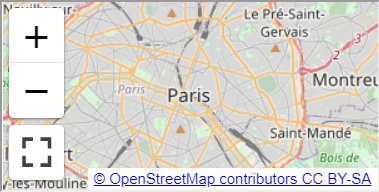

<h1>The MapML (Map Markup Language) explainer</h1>

Specification: https://maps4html.org/MapML/spec/

<h2>Author</h2>

Peter Rushforth

<h2>Participate</h2>

The W3C [Maps for HTML Community Group](https://www.w3.org/community/maps4html/) is iterating on the problem space.  You can contribute to the on-going discussion and documentation of [Use Cases and Requirements for Web mapping](https://maps4html.org/HTML-Map-Element-UseCases-Requirements/). Alternatively, if your organization is a member of the [Web Platform Incubator Community Group](https://www.w3.org/community/WICG/) (WICG) and you are able to contribute there but not elsewhere, please consider contributing through the [WICG forum on Web mapping](https://discourse.wicg.io/c/web-mapping/22).  We would love to hear from you. 

[Issue tracker for this explainer](https://github.com/Maps4HTML/MapML-Proposal/issues)

<h2 id="introduction">Introduction</h2>

Web maps are a well-established domain of Web design, and there exist popular, mature open and closed source JavaScript libraries to create and manage Web maps.  JavaScript web maps are often containers for publicly available and funded open geospatial and statistical data.  Yet despite established JavaScript libraries and server-side API standards, Web maps remain a complex Web niche that is difficult to learn, due to their extensive prerequisite knowledge requirements. As a result, there exists a community of Web map developers which contributes very little to the Web platform and which may possess little understanding that the Web exists as a distinct and standards-based platform. Similarly, the Web platform seems mostly oblivious to Web maps and their requirements, and provides no direct support for maps. In other words, Web maps existence in the Web platform depends on intermediaries which “abstract away” the Web platform.  

The goal of this proposal is to bridge the gap between the two communities in a way that may have positive benefits for both sides. On the one hand, the Web mapping community is burdened by intermediaries and the consequent barriers to widespread creation and use of maps and public map information. On the other hand, the Web platform, especially the mobile Web, needs more and better high-level features and less JavaScript. Simple yet extensible Web maps in HTML, that equally leverage the other platform standards, is the feature that both communities need to come together to improve usability and accessibility for users.

<h2>Contents</h2>

- [The Problem](#the-problem)
- [The Proposal](#the-proposal)
  - [Goals](#goals)
  - [Non-Goals](#non-goals)
  - [A High-Level API](#a-high-level-api)
  - [Key Scenarios](#key-scenarios)
- [Detailed design discussion](#detailed-design-discussion)
  - [Use Cases and Requirements](#use-cases-and-requirements)
  - [W3C/OGC Joint Workshop on Maps for the Web](#w3c-ogc-joint-workshop-on-maps-for-the-web)
- [Considered Alternative Designs of MapML](#considered-alternative-designs-of-mapml)
- [Alternative Approaches](#alternative-approaches)
- [Stakeholder Feedback / Opposition](#stakeholder-feedback--opposition)
- [References and Acknowledgements](#references-and-acknowledgements)

<h2 id="the-problem">The Problem</h2>

Web maps today are created using a wide range of technology stacks on both the client and server, some standard, some open, and some proprietary.  The complexity of choices and the wide variety of technologies required to create Web maps results in <a href="https://github.com/Malvoz/web-maps-wcag-evaluation/blob/master/README.md">maps of highly variable usability and accessibility</a>.  This has in turn led to the creation of centralized mapping services, that may or may not be implemented using Web technology; in some cases, mapping services which work well on desktop Web browsers mostly bypass the mobile Web through creation of mobile platform mapping apps, where the ‘rules of the Web platform’ (such as device permissions) do not apply.  Some centralized mapping services, both on the Web but especially on mobile technology platforms, are constructed for the purpose of tracking the user’s location and their locations of (search) interest, and using that private location information to market and re-sell highly targeted advertising. 

The problem to be solved, therefore, is to reduce the threshold complexity of creating accessible, usable and privacy-preserving Web maps, and to enable full use of Web platform standards such as HTML, URL, SVG, CSS and JavaScript in map creation, styling, presentation and interaction. 

<h2 id="the-proposal">The Proposal</h2>

To solve <a href="#the-problem">the problem</a>, our approach is to identify the Web map processing that is currently performed by JavaScript libraries which should instead be defined - in accordance with the <a href="https://www.w3.org/TR/html-design-principles/">HTML Design Principles</a> - as elements and attributes supported by CSS, while at the same time, we identify the Web map processing that should remain in the JavaScript domain as a standardized DOM API. By building the core behaviour of maps and layers into HTML, Web authors who want to build simple maps into their pages can easily do so, supported by core platform technologies, with the power of JavaScript available to enhance the core map and layer behaviour.

By lowering the barriers for Web map authors in this way, we will improve the usability, and standardize the accessibility of Web maps.  Through making map creation a matter of applying appropriately crafted Web platform standards, we will create the conditions to multiply the choices of mapping services offered to authors and users of the Web. 

In improving the choices among mapping services available through the Web platform, we will enable the growth of services that offer alternate means of paying for maps other than in exchange for the user’s personal private information, and we will enable standardized Web map accessibility through addition of maps to HTML. Finally, by making it cheaper to create Web maps than to build mobile apps, we will improve the business rationale for choosing the mobile Web as a development platform, and in doing so we hope the (mobile) Web will benefit from increased ‘success’, or network effects.

<h3 id="goals">Goals</h3>

- Define the means to allow authors to create dynamic,
usable and accessible Web maps about as easily as they can embed an image,
a video or a podcast today.
- Define and embed accessibility of map feature and location information into
HTML for use by screen readers and other assistive technology.
- Define and design security of map information considerations into the Web
platform.
- Define the markup to create mapping mashups that doesn’t necessarily require
scripting or detailed mapping server technology knowledge
i.e. that can be accomplished about as easily as linking to a document.
- Simplify the use of public
[spatial data infrastructures](https://en.wikipedia.org/wiki/Spatial_data_infrastructure)
(SDI), such as
[OpenStreetMap](https://wiki.openstreetmap.org/wiki/Main_Page)
and national and international SDIs,
by designing the integration of those services into the proposed Web platform
mapping standards.
- Defining and (advocate for) adding map-enabled HTML to the serialization
formats available from existing spatial (map) content management systems,
APIs and Web Services.

<h3 id="non-goals">Non-goals</h3>

- Interoperability with the operating model or availability of existing spatial
(map) content management systems, APIs and Web Services.
For example, the evolving
<a href="https://ogcapi.ogc.org/"><abbr title="Open Geospatial Consortium">OGC</abbr> API</a>
standards.

<h3 id="a-high-level-api">A High-Level API</h3>

The <a href="https://extensiblewebmanifesto.org/">Extensible Web Manifesto</a> calls for iterative development and evolution of platform features, starting with low-level ‘primitives’ and resulting eventually in high-level features.  Although there are several low-level primitive proposals inherent or implicated in this proposal, overall this can be seen as a proposal for a high-level feature.  That feature is declarative dynamic Web maps in HTML.  Web mapping is a mature category of JavaScript library that is well into the stage of its development life cycle that some of the aggregate characteristics of those libraries should be incorporated into the platform.  As such, this proposal captures some of the ‘cow paths’ of open and closed source JavaScript Web mapping libraries, as well as taking into consideration how to incorporate server-side mapping services and APIs.

The proposed extension would create a standard `<map>` widget that contains controls in a user agent shadow root, (similar to `<video>` today), with child `<layer>` elements which are in, and may contain, light DOM map-related markup (the vocabulary of which is also part of this proposal):

```HTML
<map zoom="11" lat="48.8566" lon="2.3522" controls controlslist="nolayer noreload">
  <layer src="https://example.com/mapml/osm/" checked crossorigin></layer>
</map>
```
<p></p>

*See the [High-Level API explainer](high-level-api.md) for details on the proposed elements that may be referred to in this proposal.*

<h3 id="key-scenarios">Key Scenarios</h3>

*See the [Key Scenarios explainer](key-scenarios.md) detailing:*

- Tiled Coordinate Reference Systems
- Linking
- Graceful Degradation and Progressive Enhancement
- Polyfill

<h2 id="detailed-design-discussion">Detailed design discussion</h2>

<h3 id="use-cases-and-requirements">Use Cases and Requirements</h3>

This proposal is being [evaluated](https://github.com/Maps4HTML/MapML/labels/Requirements%20Evaluation)
against the [Use Cases and Requirements for Standardizing Web Maps](https://maps4html.org/HTML-Map-Element-UseCases-Requirements/),
to identify gaps between the required functionality and the polyfilled behaviour.

See the [MapML Use Case, Requirement, and Capability Matrix](https://maps4html.org/UCR-MapML-Matrix/mapml-ucrs-fulfillment-matrix.html)
for how MapML compares in capabilities in contrast to existing popular web mapping libraries.

<h3 id="w3c-ogc-joint-workshop-on-maps-for-the-web">W3C/OGC Joint Workshop on Maps for the Web</h3>

Natural Resources Canada hosted the 2020
[W3C/OGC Joint Workshop Series on Maps for the Web](https://www.w3.org/2020/maps/)
in cooperation with the Maps for HTML Community Group.

See the [Report on the Joint W3C-OGC Workshop on Maps for the Web](https://www.w3.org/2020/maps/report).

<h2 id="considered-alternative-designs-of-mapml">Considered alternative designs of MapML</h2>

TBD - we have considered many alternatives, I have just run out of steam to document them, at the moment. Also this document is already quite long.  As things progress, I will add content here.

<h2 id="alternative-approaches">Alternative Approaches</h2>

- [SVGMap](https://discourse.wicg.io/t/vector-tiling-on-svgmap/3135) - is it possible to merge the SVGMap proposal and this proposal? Or are they competing proposals?
- APIs: [Leaflet](https://leafletjs.com/), [OpenLayers](https://openlayers.org/) and others, (albeit others without any notion of cross-origin resource sharing) provide excellent map scripting APIs and events.  Can these or similar APIs be built on top of the proposed HTML infrastructure? Would life be simpler for authors with the proposed HTML?
- Status quo

<h2 id="stakeholder-feedback-opposition">Stakeholder Feedback / Opposition</h2>

Some participants have said we should start over, because of the [sunk costs fallacy](https://en.m.wikipedia.org/wiki/Sunk_cost#Concorde_effect); that doesn’t seem to be in the spirit of iteration, nor hopefully is it correct to see this proposal as a waste of energy or money.  A better strategy would be to solicit concrete, actionable and incremental change requests.  It is in that spirit that the current explainer is offered. 

The objective of this project is to get Web browser projects to agree that Web maps as a high level feature are desirable and that the proposal is implementable, and _then_ to implement and ship the feature.  To get there from here, we need browser developer participation, the absence of which appears equivalent to opposition. So, there is work to do.

<h2 id="references-and-acknowledgements">References and Acknowledgements</h2>

Contributions, advice and support from the following people are gratefully acknowledged:

Benoît Chagnon, Brian Kardell, Michael<sup>tm</sup> Smith, Robert Linder, Joan Maso, Keith Pomakis, Gil Heo, Jérôme St-Louis,  Amelia Bellamy-Royds, Nic Chan, Nick Fitzsimmons, Simon Pieters, Tom Kralidis, Daniel Morissette, Chris Hodgson

If I’ve forgotten to mention you, please open an issue.

Errors and omissions are certainly my own; if you spot a correction needed in the above, please open an issue. 
