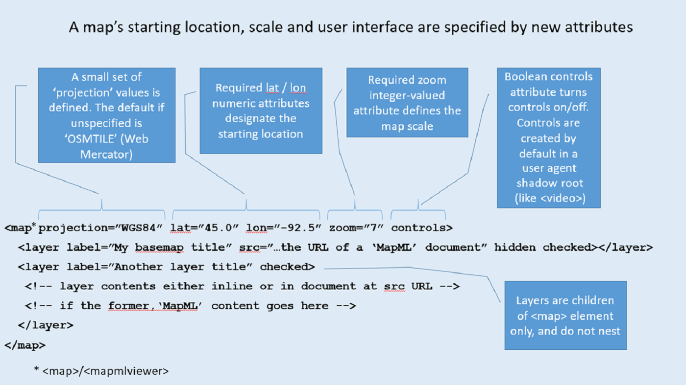
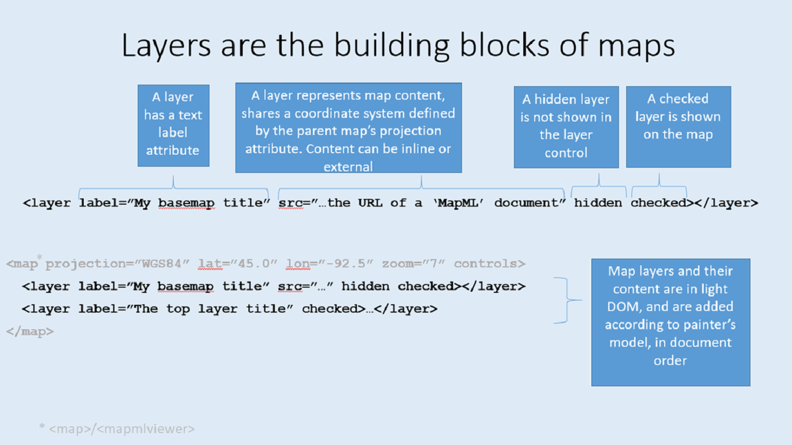

<h1>The MapML (Map Markup Language) explainer</h1>


<h2>Author</h2>


Peter Rushforth

<h2>Participate</h2>


The W3C [Maps for HTML Community Group](https://www.w3.org/community/maps4html/) is iterating on the problem space.  You can contribute to the on-going discussion and documentation of [Use Cases and Requirements for Web mapping](https://maps4html.org/HTML-Map-Element-UseCases-Requirements/). Alternatively, if your organization is a member of the [Web Platform Incubator Community Group](https://www.w3.org/community/WICG/) (WICG) and you are able to contribute there but not elsewhere, please consider contributing through the [WICG forum on Web mapping](https://discourse.wicg.io/c/web-mapping/22).  We would love to hear from you. 

[Issue tracker for this explainer](https://github.com/Maps4HTML/MapML-Proposal/issues)


<h2 id="introduction">Introduction</h2>


Web maps are a well-established domain of Web design, and there exist popular, mature open and closed source JavaScript libraries to create and manage Web maps.  JavaScript web maps are often containers for publicly available and funded open geospatial and statistical data.  Yet despite established JavaScript libraries and server-side API standards, Web maps remain a complex Web niche that is difficult to learn, due to their extensive prerequisite knowledge requirements. As a result, there exists a community of Web map developers which contributes very little to the Web platform and which may possess little understanding that the Web exists as a distinct and standards-based platform. Similarly, the Web platform seems mostly oblivious to Web maps and their requirements, and provides no direct support for maps. In other words, Web maps existence in the Web platform depends on intermediaries which “abstract away” the Web platform.  

The goal of this proposal is to bridge the gap between the two communities in a way that may have positive benefits for both sides. On the one hand, the Web mapping community is burdened by intermediaries and the consequent barriers to widespread creation and use of maps and public map information. On the other hand, the Web platform, especially the mobile Web, needs more and better high-level features and less JavaScript. Simple yet extensible Web maps in HTML, that equally leverage the other platform standards, is the feature that both communities need to come together to improve usability and accessibility for users.

<h2>Table Of Contents</h2>

- [The Problem](#the-problem)
- [The Proposal](#the-proposal)
- [Goals](#goals)
- [Non-Goals](#non-goals)
- [Alternative Approaches](#alternative-approaches)
- [A High Level API](#a-high-level-api)
  - [The `<map>` element](#the-map-element)
  - [The `<layer>` element](#the-layer-element)
  - [The `<extent>` element](#the-extent-element)
  - [The `<input>` element](#the-input-element)
  - [The `<title>` element](#the-title-element)
  - [The `<feature>` element](#the-feature-element)
  - [Tiled vector features](#tiled-vector-features)
- [Key Scenarios](#key-scenarios)
  - [Tiled Coordinate Reference Systems](#tiled-coordinate-reference-systems)
  - [Linking](#linking)
  - [Graceful Degradation and Progressive Enhancement](#graceful-degradation-and-progressive-enhancement)
  - [Polyfill](#polyfill)
- [Detailed design discussion](#detailed-design-discussion)
  - [Use Cases and Requirements](#use-cases-and-requirements)
- [Considered Alternative Designs of MapML](#considered-alternative-designs-of-mapml)
- [Stakeholder Feedback / Opposition](#stakeholder-feedback--opposition)
- [References and Acknowledgements](#references-and-acknowledgements)

<h3 id="the-problem">The Problem</h3>


Web maps today are created using a wide range of technology stacks on both the client and server, some standard, some open, and some proprietary.  The complexity of choices and the wide variety of technologies required to create Web maps results in <a href="https://github.com/Malvoz/web-maps-wcag-evaluation/blob/master/README.md">maps of highly variable usability and accessibility</a>.  This has in turn led to the creation of centralized mapping services, that may or may not be implemented using Web technology; in some cases, mapping services which work well on desktop Web browsers mostly bypass the mobile Web through creation of mobile platform mapping apps, where the ‘rules of the Web platform’ (such as device permissions) do not apply.  Some centralized mapping services, both on the Web but especially on mobile technology platforms, are constructed for the purpose of tracking the user’s location and their locations of (search) interest, and using that private location information to market and re-sell highly targeted advertising. 

The problem to be solved, therefore, is to reduce the threshold complexity of creating accessible, usable and privacy-preserving Web maps, and to enable full use of Web platform standards such as HTML, URL, SVG, CSS and JavaScript in map creation, styling, presentation and interaction. 

<h3 id="the-proposal">The Proposal</h3>


To solve <a href="#the-problem">the problem</a>, our approach is to identify the Web map processing that is currently performed by JavaScript libraries which should instead be defined - in accordance with the <a href="https://www.w3.org/TR/html-design-principles/">HTML Design Principles</a> - as elements and attributes supported by CSS, while at the same time, we identify the Web map processing that should remain in the JavaScript domain as a standardized DOM API. By building the core behaviour of maps and layers into HTML, Web authors who want to build simple maps into their pages can easily do so, supported by core platform technologies, with the power of JavaScript available to enhance the core map and layer behaviour.

By lowering the barriers for Web map authors in this way, we will improve the usability, and standardize the accessibility of Web maps.  Through making map creation a matter of applying appropriately crafted Web platform standards, we will create the conditions to multiply the choices of mapping services offered to authors and users of the Web. 

In improving the choices among mapping services available through the Web platform, we will enable the growth of services that offer alternate means of paying for maps other than in exchange for the user’s personal private information, and we will enable standardized Web map accessibility through addition of maps to HTML. Finally, by making it cheaper to create Web maps than to build mobile apps, we will improve the business rationale for choosing the mobile Web as a development platform, and in doing so we hope the (mobile) Web will benefit from increased ‘success’, or network effects.

<h3 id="goals">Goals</h3>


*   Define the means to allow authors to create dynamic, usable and accessible Web maps about as easily as they can embed an image, a video or a podcast today.
*   Define and embed accessibility of map feature and location information into HTML for use by screen readers and other assistive technology.
*   Define and design security of map information considerations into the Web platform.
*   Define the markup to create mapping mashups that doesn’t necessarily require scripting or detailed mapping server technology knowledge i.e. that can be accomplished about as easily as linking to a document.
*   Simplify the use of public spatial data infrastructures (SDI), such as OpenStreetMap and national and international SDIs, by designing the integration of those services into the proposed Web platform mapping standards.
*   Defining and (advocate for) adding map-enabled HTML to the serialization formats available from existing spatial (map) content management systems, APIs and Web Services.

<h3 id="non-goals">Non-goals</h3>


*   Interoperability with the operating model or availability of existing spatial (map) content management systems, APIs and Web Services. For example, the evolving <a href="https://ogcapi.ogc.org/"><abbr title="Open Geospatial Consortium">OGC</abbr> API</a> standards.

<h3 id="alternative-approaches">Alternative Approaches</h3>


*   [SVGMap](https://discourse.wicg.io/t/vector-tiling-on-svgmap/3135) - is it possible to merge the SVGMap proposal and this proposal? Or are they competing proposals?
*   APIs: [Leaflet](https://leafletjs.com/), [OpenLayers](https://openlayers.org/) and others, (albeit others without any notion of cross-origin resource sharing) provide excellent map scripting APIs and events.  Can these or similar APIs be built on top of the proposed HTML infrastructure? Would life be simpler for authors with the proposed HTML?
*   Status quo

<h3 id="a-high-level-api">A High Level API</h3>


The <a href="https://extensiblewebmanifesto.org/">Extensible Web Manifesto</a> calls for iterative development and evolution of platform features, starting with low-level ‘primitives’ and resulting eventually in high-level features.  Although there are several low-level primitive proposals inherent or implicated in this proposal, overall this can be seen as a proposal for a high-level feature.  That feature is declarative dynamic Web maps in HTML.  Web mapping is a mature category of JavaScript library that is well into the stage of its development life cycle that some of the aggregate characteristics of those libraries should be incorporated into the platform.  As such, this proposal captures some of the ‘cow paths’ of open and closed source JavaScript Web mapping libraries, as well as taking into consideration how to incorporate server-side mapping services and APIs.

<h4 id="the-map-element">The <a href="https://maps4html.org/MapML/spec/#the-map-element"><code>&lt;map&gt;</code></a> element</h4>


To allow authors to create declarative Web maps that have approximately the same authoring complexity as `<video>` or `<audio>` elements do today, we propose to extend the processing model of the currently existing HTML `<map>` element.  The current HTML `<map>` element, with its associated `` and child `<area>` elements constitutes a simple Web map, wherein the pixel-based coordinate system of the `` element is shared and used by the `<map>`’s child `<area>` elements to draw geometries to act as hyperlinks.  This relationship, that of parent node-child node with a shared coordinate system is an ideal extension point for more dynamic Web mapping. If it turns out that the code involved in the `<map>` element implementation is too much like spaghetti, we will have to create a new and similar element anyway.  So if possible we should avoid that particular form of technical debt and adopt, maintain and extend the existing `<map>` element.

The proposed extension would create a standard `<map>` widget that contains controls in a user agent shadow root, (similar to `<video>` today), with child [`<layer>`](#the-layer-element) elements which are in, and may contain, light DOM map-related markup, the vocabulary of which is also part of this proposal.





<h4 id="the-layer-element">The <a href="https://maps4html.org/MapML/spec/#the-layer-element"><code>&lt;layer&gt;</code></a> element</h4>


A layer is a primitive abstraction that is shared by many if not most maps, both on and off the Web. Even in the case that a map doesn’t have more than a single layer, the map itself can be considered to be composed of that single layer. A key characteristic of map layers is that they share the same coordinate system as other layers in the map, allowing the rendering engine to lay out and render content over the same coordinate space.  This is in contrast to the normal rendering of HTML elements, which are laid out in document order down the page. There is precedent for the proposed rendering model for maps in HTML, however.  The [client-side image map](https://html.spec.whatwg.org/multipage/image-maps.html#image-maps) of HTML, implemented by the ``, `<map>` and `<area>` elements, has this rendering model; the `<area>`s `coords` attribute are expressed in units of the pixel-based coordinate system of the `<map>`-associated `` element.  An author-friendly system for dynamic Web mapping, such as that intended by this proposal, would make it as simple as possible to automatically layer map content, ideally re-using and extending the markup for `` `<map>` and `<area>` that has become familiar.  A more thorough discussion of how this proposal conforms or relates to the HTML Design Principles is beyond the scope of this explainer, but is available [here](https://www.w3.org/community/maps4html/2019/12/09/the-design-of-mapml/).

<span id="bookmark1"></span>


Layers are added to maps by adding `<layer>` elements as children of the `<map>` element. Every `<layer>` added to the map must share the same coordinate system declared by the `<map>` in its `projection` attribute. If the layer added does not share the same coordinate system as the `<map>`, it will not be displayed and the layer will be ‘disabled’ in the layer control of the map widget. The set of possible coordinate systems is small, and the values enumerated by the MapML specification.  If no `projection` attribute is specified, the default coordinate system is that of Web Mercator, signified by the `OSMTILE` value. 

The `<layer>` element renders content by one of two alternate means.  The first is by referring to remote content at a URL specified by the `src` attribute. This is described under [Key Scenarios](#key-scenarios) below. The response to a request of the `src` value should be “MapML” content, identified over the network by the `text/mapml` media type.  MapML is intended to be part of the HTML vocabulary and to be parsed with the (almost) unmodified HTML parser.  To achieve that, some elements in the [MapML specification](https://maps4html.org/MapML/spec/) rely on and extend the definitions of elements of the same name in HTML. The second rendering path for `<layer>` is to include “MapML” content inline in light DOM. 

It’s great that we can imagine a way to extend HTML to include dynamic Web maps using almost-existing browser code infrastructure, but where will layer content as envisioned come from?  Without content, new browser code would not be useful.  What’s needed is a way to get the vast amount of existing content from services that have [well-defined standard and not-so-standard interfaces](https://www.geoseer.net/), into the new HTML-MapML format available at simple URLs, without requiring significant change to the content, but especially without requiring browsers to ‘understand’ interfaces other than the uniform interface of HTTP.  This might seem like a tall order, but a key design constraint followed by HTML-MapML is that the vocabulary itself should represent abstractions that ‘fit’ the existing content, so that if the services by which the content is accessed today were to provide HTML-MapML as a serialization format, then such content would be rendered inherently compatible with browsers, even before script execution.  Such experimentation has formed the basis of significant experimentation by several participants through the [OGC Testbed program](https://www.youtube.com/playlist?list=PLQsQNjNIDU85HBDZWc8aE7EvQKE5nIedK), and has proven to be readily possible in practice, through the creation of [server shims](https://docs.geoserver.org/latest/en/user/community/mapml/index.html).  We anticipate that should the Web community agree to work with the mapping community on this proposal, that we will have success in persuading the public spatial data infrastructures around the world to be made available to the browser in HTML-MapML.

<h4 id="the-extent-element">The <a href="https://maps4html.org/MapML/spec/#the-extent-element"><code>&lt;extent&gt;</code></a> element</h4>


Web maps’ content is, typically, but not exclusively,  provided by content servers associated with server-side Geographic Information Systems and their APIs.  These APIs often share common semantics associated to maps and map features, although typically with differing terminology between services. In order to access the widest variety of map services as possible, we created the  `<extent>` element, which can be a child of the `<layer>` element:


```html
<layer label="Canada Base Map" checked>
  <extent units="OSMTILE">
    <input name="z" type="zoom" value="17" min="0" max="17">
    <input name="y" type="location" units="tilematrix" axis="row" min="29750" max="34475">
    <input name="x" type="location" units="tilematrix" axis="column" min="26484" max="32463">
    <link rel="tile" tref="https://.../tile/{z}/{y}/{x}/">
  </extent>
</layer>
```


In order to decouple the client HTML vocabulary from server vocabularies, we use the pattern in HTML established by the `<form>` and `<input>` elements, which is a way to template the URL (in `<form>`s the URL is contained in the `<form action="">` attribute) to which the form submission occurs.  The `<extent>` element for map layers acts in a similar role to `<form>` in this decoupling, except that it establishes a two-dimensional rectangular context for server submissions, linked to the corresponding dimensions of the ancestor `<map>` element.  The `<extent>` submission events are generated automatically by the user events (pan or zoom) or user-agent actions (map resize).

<h4 id="the-link-rel=tile-or-image-tref-element">The <code>rel</code> and <code>tref</code> attributes</h4>


In HTML, the `<form>` element has the `action` attribute, whose value is a URL to which the form’s submission is directed, once action processing is completed.  We experimented with an `action` attribute on the `<extent>` element ([Issue #61](https://github.com/Maps4HTML/MapML/issues/61)), but we found it to be not as effective a mechanism for Web maps, for several reasons, including the fact that map services don’t always use URL query parameters, they sometimes also use URL path segments to identify server resources. So we followed the cow path established by the Leaflet and OpenLayers open source Web mapping libraries and added a proposal to extend the `<link>` element with map-specific link `rel` values, plus the `tref` attribute which contains a URL template.  

The processing model is similar, and related to that of `<form action="">`, in that just before submission, the extent is processed for inputs that specify named variables, whose values at the moment of submission are serialized into the URL template specified in the `tref` attribute, in the locations specified by their variable references, denoted by {varname}.  In this way, the actual varname values are decoupled from the specification, and are not required until submission.


```html
<input name="z" type="zoom" value="17" min="0" max="17">
...
<link rel="tile" tref="https://.../tile/{z}/{y}/{x}/">
```


The reason for specifying this as an extension of the `<link>` element is because there can be more than a single template processed within such an extent, retrieving image or document resources for each, and rendering the result in document order, for example, geometries and labels for a single “layer” may be rendered via different resource templates / links ([example](https://geogratis.gc.ca/mapml/en/osmtile/cbmt/)).

<h4 id="the-input-element">The <a href="https://maps4html.org/MapML/spec/#the-input-element"><code>&lt;input&gt;</code></a> element</h4>


There are four proposed types of input in MapML: `location`, `zoom`, `width` and `height`. Like inputs in HTML, each input has a `name` attribute which specifies the name of the variable to be set by the input.  This is the core mechanism whereby URLs processed by the browser are decoupled (or indirectly coupled, at least) from the services they are used to access; a server URL may be composed of names, the meanings of which are known to the service or domain, but which are meaningless to the browser. In this way, the client and service are directly coupled to the MapML specification, but decoupled from each other.

<h5 id="the-input-type-location-state">The <code>type="location"</code> state</h5>


Locations are specified in coordinates of one of the coordinate systems associated to the root “projection”, also known as a Tiled Coordinate Reference System, which is a term defined by MapML in order to unify concepts and vocabulary required for enabling maps in HTML. The location input has several attributes which authors specify to control the serialization of the location.  However, the coordinate systems of the Tiled Coordinate Reference Systems defined by MapML are widely understood even outside MapML; MapML mostly standardizes the terminology around those coordinate systems, especially the names,  into the specification for the purpose of using that terminology in the input attributes.  

<h6 id="the-input-type-location-units-attribute">The <code>units</code> attribute</h6>


Dynamic Web maps are pannable, zoomable and queryable through user gestures.  As a map is manipulated, it may require new content to cover its extent, or to respond to a query. To get new content, location events are generated for the extent implicated in the event (or a part of the extent, such as a map tile). Locations associated with the events are referenced by location inputs, by virtue of the combination of input attributes.  The `units` attribute has a small set of possible values, which can be one of `tcrs`, `pcrs`, `gcrs`, `map`, `tilematrix` or `tile`.  Each of these values signifies the child coordinate system from the parent [tiled coordinate reference system](#tiled-coordinate-reference-systems) in which the event is considered to take place.  If the author specifies `units="tilematrix"`, for example, the location input refers to the location of each required tile as it is required. 

<h6 id="the-input-type-location-axis-attribute">The <code>axis</code> attribute</h6>


In the following example, the inputs with names ‘x’ and ‘y’ request the event location’s column and row coordinate axes, respectively. Note that while the location of the event has all three properties of a location in a tiled coordinate reference system, (i.e. zoom, horizontal axis value, and vertical axis value) the input is only able to refer to or serialize one property of the location.  Hence, the input carries the `axis` attribute, referring to the name of the horizontal axis (column, in the example below) and vertical axis (row, below) whose value is required.  The “zoom” property of a location event isn’t considered a coordinate axis, and zoom has an input type of its own. Nevertheless, a location event always has a zoom value.  ([Issue #56](https://github.com/Maps4HTML/MapML/issues/56))


```html
<extent units="OSMTILE">
  <input name="z" type="zoom" value="15" min="0" max="15">
  <input name="y" type="location" units="tilematrix" axis="row">
  <input name="x" type="location" units="tilematrix" axis="column">
  <link rel="tile" tref="https://.../tile/{z}/{y}/{x}/">
</extent>
```


All of the child coordinate systems of the parent tiled coordinate reference system exist in the same space; they are equivalent ways of referring to locations in the extent.  As such, when requesting a location’s coordinates, we aren’t limited to the coordinate axes of the child coordinate system identified in the `units` attribute, we could request any valid child coordinate systems axis. For example, if we want to specify the latitude of the tile event in the above example, we could have specified the `axis="latitude"`.  This returns the latitude of the center (by default) of the tile event. The set of legal axis names are: ‘x,y’ (from the tcrs pixel-based coordinate system), ‘i,j’ (from the map or tile pixel-based coordinate systems), ‘row,column’ (from the tile-based tilematrix coordinate system), ‘easting,northing’ (from the pcrs meter-based coordinate system), and ‘latitude,longitude’ (from the decimal-degrees-based gcrs coordinate system).

<h6 id="the-input-type-location-position-attribute">The <code>position</code> attribute</h6>


Location events can be relative to the rectangle of an extent or part of an extent.  The `position` attribute has a small set of possible values, which identify the location that is requested.  These are: `center` (the default), `top-center`, `bottom-center`, `top-left`, `top-right`, `bottom-left`, and `bottom-right`.  These named positions identify locations relative to a defined rectangle, such as the map extent, or the extent of a tile.  This allows the author to request locations that the user agent ‘understands’ as simply as possible. (Issue [#27](https://github.com/Maps4HTML/MapML/issues/27))

<h6 id="the-input-type-location-rel-attribute">The <code>rel</code> attribute</h6>


Location events generated by an extent can be located at a relative position of the extent, as identified by the `position` attribute.  The extent to which the event is related is by default the map extent.  By specifying the `rel="tile"` value, the position refers to the position on the tile in which the event is located.  This facility was designed to support querying of WMTS tiles, which require the pixel coordinates of the pixel within the tile in order to query the tile store.  ([Issue #57](https://github.com/Maps4HTML/MapML/issues/57))

<h6 id="the-input-type-location-min-and-max-attributes">The <code>min</code> and <code>max</code> attributes</h6>


The `<input type="location">`’s `min` and `max` attributes should be used together.  They are a way for the server to describe axis bounds that can be respected by the client.  When the client generates an event that results in a value for the input that is outside the established range (because the map is viewing a scene outside the range for this particular layer), no request will be made to URLs that require the variable to have a value.  In this way, the server can avoid needless traffic to itself by transmitting min/max on inputs for zoom and location axes.

<h5 id="the-input-type-zoom-state">The <code>type="zoom"</code> state</h5>

<h6 id="the-input-type-zoom-min-max-and-value-attributes">The <code>min</code>, <code>max</code> and <code>value</code> attributes</h6>


The `<input type="zoom">`’s `min` and `max` attributes should be used together.  They are a way for the server to describe the zoom limits that can be respected by the client, similar to the range established for axes limits by location inputs. The `value` attribute should be used to establish the zoom level at which axis bounds are value. 


In the following example, the zoom value is set at 17.  This means for example, that the row axis has a minimum value of 29750 and a maximum value of 34475 at zoom level 17.  The maximum and minimum values of the row axis at zooms 0 through 16 are calculated by transforming the value at zoom 17.  The reason for this is resolution.  Recall that at zoom level 0 some tiled coordinate reference systems may only be one tile by one tile, and so defining min and max in terms of tiles at zoom level 0 may not be precise enough to avoid redundant tile requests (that would result in 404 Not found).


```html
<extent units="CBMTILE">
  <input name="z" type="zoom" value="17" min="0" max="17">
  <input name="y" type="location" units="tilematrix" axis="row" min="29750" max="34475">
  <input name="x" type="location" units="tilematrix" axis="column" min="26484" max="32463">
  <link rel="tile" tref="https://.../tile/{z}/{y}/{x}/">
</extent>
```


For server-friendliness, it’s important for the author to establish the axis (and zoom)  bounds on a per-`<link>` template basis.  For example, there may be more than a single tile link template in an `<extent>`, with `<input>`s established to supply variable values to each one’s link template.  The reason might be to define a composite layer from different server image tile pyramids, for example.  One of the tile pyramids might not share the entire set of zoom levels with the other, nor indeed cover the same geographic extent (bounding box).  For this reason, separate zoom and axis bounds should be established by setting up different `<input>` variables to supply the different URL (`<link>`) templates, and thus generate only valid (200 OK) URLs.

<h4 id="the-tile-element">The <a href="https://maps4html.org/MapML/spec/#the-tile-element"><code>&lt;tile&gt;</code></a> element</h4>


The `<tile>` element doesn’t get used too much in practice.  Early on, we defined the `<extent action>` attribute, which made `<extent>` quite `<form>`-like, and which required that the server returned a MapML document with individual `<tile>` elements for each tile.  This meant that each zoom or pan (or resize), would require the server to generate and send a new MapML document, which would then be parsed and rendered by the client.  While functional, it turned out to be “chatty”, and unnecessary. ([Issue #61](https://github.com/Maps4HTML/MapML/issues/61))

Although the polyfill behaviour has not yet been thoroughly established through experimentation, the `<link rel="tile" ...>` element could be considered to generate `<tile>` elements in the DOM automatically, without having to parse a document containing such.  This will still allow scripted access to the DOM tiles, which will be important and useful, for example for accessing and manipulating map content on the client.

The `<tile>` element can also be used to serve static MapML content, for example to serve a directory of tiled images that have been statically generated.   An intelligent map client could cache these behind the scenes, and so provide better, perhaps even offline, performance for a map layer.

<h4 id="the-feature-element">The <a href="https://maps4html.org/MapML/spec/#the-feature-element"><code>&lt;feature&gt;</code></a> element</h4>


The `<feature>` element’s design mirrors what Web map developers actually do with vector information, which is commonly encoded in JSON as ‘GeoJSON’.  The feature element has a `<properties>` child element, which is intended for human-readable HTML markup, rendered in its own browsing context such as a popup or pullout, and a `<geometry>` child element for the map-displayable feature content.  The need for a new `<geometry>` element is driven by the need to style and embed links in content, described below.
<span id="bookmark2"></span>

```html
<feature>
  <geometry>
    <multipolygon>
      <polygon>
         <a href="https://example.org/canada/mapml">
           <coordinates class="f72 outer">59.5303058 74.7915903 59.7266984 74.7479857 … 76.1838491 <span class="noline">67.5 76.1894504 67.5 76.7412725 67.5 77.0079535</span> 67.2115912 76.9522523 … 74.727385 59.5303058 74.7915903</coordinates>
         </a>
         <coordinates class="f72 hole">54.8127632 73.6650796 54.9487273 73.7169245 55.1327595 73.7134911 54.940487 73.6654229 54.8127632 73.6650796</coordinates>
       </polygon>
       <polygon>
         <coordinates class="f72 outer">58.7310016 75.895097 59.219923 75.946598 59.240523 75.995353 58.8079106 75.925311 58.7310016 75.895097</coordinates>
       </polygon>
     </multipolygon>
   </geometry>
   <properties>
     <table>
       <thead>
         <tr><th>Property name</th><th>Property value</th></tr>
       </thead>
       <tbody>
         <tr><th>scalerank</th><td>0</td></tr>
         <tr><th>featurecla</th><td>Admin-0 country</td></tr>
         <tr><th>labelrank</th><td>2</td></tr>
         <tr><th>sovereignt</th><td>Canada</td></tr>
         … 
         <tr><th>subregion</th><td>North America</td></tr>
      </tbody>
     </table>
   </properties>
</feature>
```


One of the use cases for modern Web maps is the application of CSS to feature styling.  In order to style feature vectors with CSS without duplicating them (duplication is semantically inappropriate, not to mention wasteful of resources), the parts must be selectable, and are thus represented as `<coordinates>` elements. In the case of `<polygon>`s, shown in the above example, the outer boundary ring is represented by the first child `<coordinates>` element, and interior holes in the polygon are represented by subsequent child `<coordinates>` elements.

The types of vector geometries for which there are proposed elements are:

`<point>`, `<linestring>`, `<polygon>`, `<multipoint>`, `<multilinestring>`, `<multipolygon>` and `<geometrycollection>`.  These types reflect the semantics of their counterparts in GeoJSON and most or all standards-based Geographic Information System vector formats.

<h4 id="tiled-vector-features">Tiled vector features</h4>


The selectability of features’ vector parts is useful in allowing servers to serve tiled or otherwise partitioned feature data without (necessarily) introducing visual or semantic ‘noise’.  The objective of doing so is often (but not exclusively) related to optimizing or minimizing bandwidth consumption; whereas tiled images can consume a lot of bandwidth, relatively (and depending on what content is being represented), tiled vector information can conserve bandwidth while conveying feature semantics both visually and through markup. In the screen capture below, tiled vector features (support simulated with SVG + CSS + JavaScript) are selected and styled in solid (random) colors and outlined in blue. They are displayed with no CSS rule to selectively style or hide ‘artificial’ vector segments introduced by tile boundaries.


```css
coordinates.f72.outer { stroke: blue; fill: #DAA520; }
coordinates.f72.hole { stroke: blue; fill: none; }
```


In the next screen capture, below, a CSS selector for span.noline is introduced, which hides the tile boundaries.


```css
coordinates.f72.outer { stroke: blue; fill: #DAA520; }
coordinates.f72.hole { stroke: blue; fill: none; }
span.noline { display: none; }
```


A video demo of this feature is [available](https://www.youtube.com/watch?v=ctGrhFgAONE). 

<h2 id="key-scenarios">Key scenarios</h2>


<h3 id="tiled-coordinate-reference-systems">Tiled Coordinate Reference Systems</h3>


Perhaps the most important characteristic of Web maps that is essential for standardization, is the definition of the coordinate reference systems and the scale of the display. 


<h3 id="linking">Linking</h3>


<h4 id="including-map-layers-in-html-by-reference">Including map layers in HTML by reference</h4>


[Cartography](https://en.wikipedia.org/wiki/Cartography) is a challenging discipline, no matter the media in which it is performed.  The Web medium demands an entirely new kind of cartography, one which makes maps potentially more valuable than ever, by rendering them dynamically pannable and scalable, among other characteristics.  The new cartographers have a large and powerful set of server technologies, commonly known as [Geographic Information Systems](https://en.wikipedia.org/wiki/Geographic_information_system). Coupled with open data, and public server APIs, Web cartographers are able to easily publish their products.

<h5 id="the-text-mapml-mime-type">The <code>text/mapml</code> MIME type</h5>


So, how to make it simple to make Web maps?  In order to allow HTML authors to make use of existing cartographic services on the Web, such as Web Map Services (WMS) and Web Map Tile Services (WMTS) we propose to create a new document and associated MIME type, `text/mapml`, which can be used by HTML authors and map services to support the key use case of publishing a Web map, with about the same authoring complexity as that of publishing a `<video>`, a `<audio>` or an ``, that is, by using the `<layer src="https://example.org/map/document/url/"></layer>` [formulation](#bookmark1). 

The proposed doctype for such a map document is  `<!doctype mapml>`, which signals to the HTML parser that it is parsing a MapML document. The root element of a MapML document is `<mapml>`. Like HTML, a MapML document has a `<head>` element, for map document metadata, and a `<body>` for map content.  The content of the document is MapML, that is, the elements from this proposal, which are rendered via coordinates in the coordinate system designated by the `<map>` (`projection` attribute).

<h5 id="links-from-html-to-mapml">Links from HTML to MapML</h5>


It’s one thing to have an element like `<layer>` to provide the client logic for a MapML document embedded in an HTML document, but what should happen if a simple `<a href="">` pointed to a MapML document?  We’ve said that a MapML document should be parseable with the HTML parser, so what should the default behaviour of activating such link be?  Probably, it should be similar to that behaviour which happens when you create a link to a media type that is natively supported by HTML, such as image/png or video/mp4: the browser synthesizes a simple HTML document with a client element such as `` or `<video><source src=""></video>`, i.e. it should synthesize an HTML document with a `<map><layer src=""></layer></map>` element with default or generated metadata and parameters.

<h4 id="links-for-layer-alternate-styles">Links for layer alternate styles</h4>


```html
<mapml lang="en">
   <head>
     <meta charset="utf-8">
     <title>States</title>
     <link href="./?style=pophatch" rel="style" title="pophatch">
     <link href="./?style=polygon" rel="style" title="polygon">
     <link href="./?style=" rel="self style" title="population">
   </head>
…
</mapml>
```


Results in a rendered map widget UI with links to mutually exclusive options:


Selecting the ‘pophatch’ link responds with a different MapML document:


```html
<mapml lang="en">
   <head>
     <meta charset="utf-8">
     <title>States</title>
     <link href="./?style=pophatch" rel="self style" title="pophatch">
     <link href="./?style=polygon" rel="style" title="polygon">
     <link href="./?style=" rel="style" title="population">
   </head>
…
</mapml>
```

which replaces that layer’s browsing context with a different representation of the layer:


In the above code example, a MapML document provides links to alternate ‘styles’ of itself.  The current map document is additionally and importantly tagged with the `self` link relation. This link-based facility is very powerful, because what constitutes a ‘style’ for the current map document is in the eye of the document author, and is not limited to a representation with an alternate stylesheet applied to the same data. What is linked to as a ‘style’ may be a radically different rendering of ‘this layer’, even different data, for example a satellite view vs. a topographic/street map rendering (which are obviously not simply different stylesheet renderings of the same data, as in the above example, but are in fact different data for the same extent). 

<h4 id="links-for-alternate-layer-coordinate-systems-projections">Links for alternate layer coordinate systems (projections)</h4>


Geographic Information Systems allow us to provide the same data in a variety of coordinate systems.  When the same layer data is available in different MapML coordinate systems, service providers can make it easy to select the right URL for a layer by encoding links to the current data represented in alternate coordinate systems, in the document metadata (in the head). The user agent can, based on the required projection designated by the `<map projection="">` attribute, automatically select (negotiate) from among the advertised links, as shown below.  The coordinate system selection/negotiation process is transparent and requires no input from the user; if the URL used by the author in the `<layer src="">` value leads to a MapML document with a coordinate system that does not match its parent `<map projection="">` value, the user agent will select the correct advertised alternate to replace it.


```html
<mapml lang="en">
   <head>
       <meta charset="utf-8">
       <title>States</title>
       <meta name="projection" content="OSMTILE">
       <link href="./CBMTILE" rel="alternate" projection="CBMTILE">
       <link href="./APSTILE" rel="alternate" projection="APSTILE">
       <link href="./WGS84" rel="alternate" projection="WGS84">
   </head>
...
</mapml>
```


`alternate` [link relations](https://html.spec.whatwg.org/multipage/links.html#linkTypes) are used to provide alternate representations by format and other criteria.  In this case, the `projection` attribute is used by the UA to distinguish the links within the link group identified by the `alternate` link relation.

<h4 id="links-between-map-services">Links between map services</h4>


This feature could enable federation of map services in a way similar to the ‘federation’ of the HTML Web today, in that in today’s Web, authors decide to link to others’ Web sites and so the federation of sites constituting the Web is enabled.  The MapML-enabled Web should follow a similar path, in that not every Web map needs or can contain all the map information in the world.  So, links should be used to allow map authors to link to others maps in a similar way.  I believe this blends with or is the same as the [Links between locations](#links-between-locations) use case, below.

In the `<feature>` markup [shown above](#bookmark2), a standard hyperlink is shown, wrapped around the outer polygon coordinates of a feature’s geometry:


```html
<polygon>
  <a href="https://example.org/canada/mapml">
    <coordinates class="f72 outer">59.5303058 74.7915903 59.7266984 74.7479857 … 76.1838491 <span class="noline">67.5 76.1894504 67.5 76.7412725 67.5 77.0079535</span> 67.2115912 76.9522523 … 74.727385 59.5303058 74.7915903</coordinates>
  </a>
</polygon>
```


Links like this could have a default visual and accessible cue to indicate link-ness, like its text-wrapping `<a href>` counterpart, that would signal what the user should expect to happen if activated with a gesture.  Useful actions could include: replacing the entire (root) browsing context with another map or HTML document, or loading the link target into the map layer browsing context from which it was activated.

Like `<span>` elements, `<a>` elements could appear within the `<coordinates>` element, allowing links from geometry parts.

<h4 id="links-between-locations">Links between locations</h4>


Links between locations could be marked up similarly to links between services as described above, possibly with the addition of attributes indicating the location and zoom of the link destination. The current location of a map could be modified by activating links from one location to another.  There might need to be a different visual / accessible cue for such links.  By default, the map might animate in a “fly to” manner in response to link activation.

<h3 id="graceful-degradation-and-progressive-enhancement">Graceful Degradation and Progressive Enhancement</h3>


There are many older browsers still in use on the Web, and they will likely be in use for many years to come, for a variety of reasons.  Fortunately, “client-side image maps” were very popular on the Web at one stage, and this functionality is well supported by older browsers.  For HTML authors who wish to provide a Web mapping experience for users of these older browsers, it should be possible to provide “fallback” markup that enables the core map experience they wish users to have, while providing a progressively enhanced experience for users of evergreen browsers, without relying on archaic scripting APIs.

If `<area>` elements are present (for fallback) as child elements of `<map>`, they are (progressively, if the conditions warrant) treated as `<layer>` elements containing a single geographic feature, with coordinates in the `coords` attribute being interpreted as being valid pixel coordinates in the map’s locally defined map coordinate system.   More detail and a working example of how graceful degradation and progressive enhancement could work in this proposal is available [here](https://maps4html.org/Web-Map-Custom-Element/blog/progressive-web-maps.html).

<h3 id="polyfill">Polyfill</h3>

- A [custom `<map>` element prototype](https://github.com/Maps4HTML/Web-Map-Custom-Element/blob/master/index-web-map.html) is available, although it’s not yet a fully compliant ‘polyfill’. Unfortunately, `<map>` _as a custom element_ has a [severe accessibility issue](https://github.com/w3c/html-aam/issues/292), due to the nature of current implementations of `<map>` in browsers. The prototype [doesn’t work on Webkit](https://caniuse.com/#feat=mdn-api_customelementregistry_builtin) due to the use of unsupported custom built-in elements.
- A parallel [`<mapml-viewer>`](https://github.com/Maps4HTML/Web-Map-Custom-Element/blob/master/index-mapml-viewer.html) (see [demo](https://geogratis.gc.ca/mapml/)) autonomous custom element suite is available in all major browsers.  

The light DOM content of `<layer>` is not currently active or available as an API.

<h2 id="detailed-design-discussion">Detailed design discussion</h2>


<h3 id="use-cases-and-requirements">Use Cases and Requirements</h3>


This proposal is being [evaluated](https://github.com/Maps4HTML/MapML/labels/Requirements%20Evaluation) against the [Use Cases and Requirements](https://maps4html.org/HTML-Map-Element-UseCases-Requirements/) for Web mapping, to identify gaps between the required functionality and the polyfilled behaviour.

<h2 id="considered-alternative-designs-of-mapml">Considered alternative designs of MapML</h2>


TBD - we have considered many alternatives, I have just run out of steam to document them, at the moment. Also this document is already quite long.  As things progress, I will add content here.

<h2 id="stakeholder-feedback-opposition">Stakeholder Feedback / Opposition</h2>


Some participants have said we should start over, because of the [sunk costs fallacy](https://en.m.wikipedia.org/wiki/Sunk_cost#Concorde_effect); that doesn’t seem to be in the spirit of iteration, nor hopefully is it correct to see this proposal as a waste of energy or money.  A better strategy would be to solicit concrete, actionable and incremental change requests.  It is in that spirit that the current explainer is offered. 

The objective of this project is to get Web browser projects to agree that Web maps as a high level feature are desirable and that the proposal is implementable, and _then_ to implement and ship the feature.  To get there from here, we need browser developer participation, the absence of which appears equivalent to opposition. So, there is work to do.

<h2 id="references-and-acknowledgements">References and Acknowledgements</h2>


Contributions, advice and support from the following people are gratefully acknowledged:

Benoît Chagnon, Brian Kardell, Michael<sup>tm</sup> Smith, Robert Linder, Joan Maso, Keith Pomakis, Gil Heo, Jérôme St-Louis,  Amelia Bellamy-Royds, Nic Chan, Nick Fitzsimmons, Simon Pieters, Tom Kralidis, Daniel Morissette, Chris Hodgson

If I’ve forgotten to mention you, please open an issue.

Errors and omissions are certainly my own; if you spot a correction needed in the above, please open an issue. 
