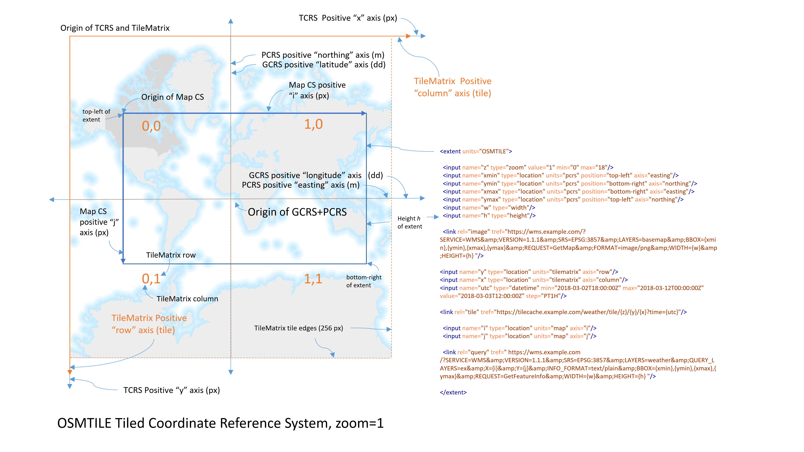

<h1 id="key-scenarios">Key scenarios</h1>

Key scenarios of the [MapML Proposal](README.md).

<h2>Contents</h2>

- [Tiled Coordinate Reference Systems](key-scenarios.md#tiled-coordinate-reference-systems)
- [Linking](key-scenarios.md#linking)
  - [Including map layers in HTML by reference](#including-map-layers-in-html-by-reference)
  - [Links from HTML to MapML](#links-from-html-to-mapml)
  - [Links for layer alternate styles](#links-for-layer-alternate-styles)
  - [Links for alternate layer coordinate systems (projections)](#links-for-alternate-layer-coordinate-systems-projections)
  - [Links between map services](#links-between-map-services)
  - [Links between locations](#links-between-locations)
- [Graceful Degradation and Progressive Enhancement](key-scenarios.md#graceful-degradation-and-progressive-enhancement)
- [Polyfill](key-scenarios.md#polyfill)

<h3 id="tiled-coordinate-reference-systems">Tiled Coordinate Reference Systems</h3>

Perhaps the most important characteristic of Web maps that is essential for standardization, is the definition of the coordinate reference systems and the scale of the display. 



<h3 id="linking">Linking</h3>

<h4 id="including-map-layers-in-html-by-reference">Including map layers in HTML by reference</h4>

[Cartography](https://en.wikipedia.org/wiki/Cartography) is a challenging discipline, no matter the media in which it is performed.  The Web medium demands an entirely new kind of cartography, one which makes maps potentially more valuable than ever, by rendering them dynamically pannable and scalable, among other characteristics.  The new cartographers have a large and powerful set of server technologies, commonly known as [Geographic Information Systems](https://en.wikipedia.org/wiki/Geographic_information_system). Coupled with open data, and public server APIs, Web cartographers are able to easily publish their products.

<h5 id="the-text-mapml-mime-type">The <code>text/mapml</code> MIME type</h5>

In order to allow HTML authors to make use of existing cartographic services on the Web, such as Web Map Services (WMS) and Web Map Tile Services (WMTS) we propose to create a new document and associated MIME type, `text/mapml`, which can be used by HTML authors and map services to support the key use case of publishing a Web map, with about the same authoring complexity as that of publishing a `<video>`, a `<audio>` or an ``, that is, by using the `<layer src="https://example.org/map/document/url/"></layer>` [formulation](high-level-api.md#bookmark1). 

The proposed doctype for such a map document is  `<!doctype mapml>`, which signals to the HTML parser that it is parsing a MapML document. The root element of a MapML document is `<mapml>`. Like HTML, a MapML document has a `<head>` element, for map document metadata, and a `<body>` for map content.  The content of the document is MapML, that is, the elements from this proposal, which are rendered via coordinates in the coordinate system designated by the `<map>` (`projection` attribute).

<h5 id="links-from-html-to-mapml">Links from HTML to MapML</h5>

It’s one thing to have an element like `<layer>` to provide the client logic for a MapML document embedded in an HTML document, but what should happen if a simple `<a href="">` pointed to a MapML document?  We’ve said that a MapML document should be parseable with the HTML parser, so what should the default behaviour of activating such link be?  Probably, it should be similar to that behaviour which happens when you create a link to a media type that is natively supported by HTML, such as image/png or video/mp4: the browser synthesizes a simple HTML document with a client element such as `` or `<video><source src=""></video>`, i.e. it should synthesize an HTML document with a `<map><layer src=""></layer></map>` element with default or generated metadata and parameters.

<h4 id="links-for-layer-alternate-styles">Links for layer alternate styles</h4>

```html
<mapml lang="en">
   <head>
     <meta charset="utf-8">
     <title>States</title>
     <link href="./?style=pophatch" rel="style" title="pophatch">
     <link href="./?style=polygon" rel="style" title="polygon">
     <link href="./?style=" rel="self style" title="population">
   </head>
…
</mapml>
```

Results in a rendered map widget UI with links to mutually exclusive options:


Selecting the ‘pophatch’ link responds with a different MapML document:

```html
<mapml lang="en">
   <head>
     <meta charset="utf-8">
     <title>States</title>
     <link href="./?style=pophatch" rel="self style" title="pophatch">
     <link href="./?style=polygon" rel="style" title="polygon">
     <link href="./?style=" rel="style" title="population">
   </head>
…
</mapml>
```

which replaces that layer’s browsing context with a different representation of the layer:


In the above code example, a MapML document provides links to alternate ‘styles’ of itself.  The current map document is additionally and importantly tagged with the `self` link relation. This link-based facility is very powerful, because what constitutes a ‘style’ for the current map document is in the eye of the document author, and is not limited to a representation with an alternate stylesheet applied to the same data. What is linked to as a ‘style’ may be a radically different rendering of ‘this layer’, even different data, for example a satellite view vs. a topographic/street map rendering (which are obviously not simply different stylesheet renderings of the same data, as in the above example, but are in fact different data for the same extent). 

<h4 id="links-for-alternate-layer-coordinate-systems-projections">Links for alternate layer coordinate systems (projections)</h4>

Geographic Information Systems allow us to provide the same data in a variety of coordinate systems.  When the same layer data is available in different MapML coordinate systems, service providers can make it easy to select the right URL for a layer by encoding links to the current data represented in alternate coordinate systems, in the document metadata (in the head). The user agent can, based on the required projection designated by the `<map projection="">` attribute, automatically select (negotiate) from among the advertised links, as shown below.  The coordinate system selection/negotiation process is transparent and requires no input from the user; if the URL used by the author in the `<layer src="">` value leads to a MapML document with a coordinate system that does not match its parent `<map projection="">` value, the user agent will select the correct advertised alternate to replace it.

```html
<mapml lang="en">
   <head>
       <meta charset="utf-8">
       <title>States</title>
       <meta name="projection" content="OSMTILE">
       <link href="./CBMTILE" rel="alternate" projection="CBMTILE">
       <link href="./APSTILE" rel="alternate" projection="APSTILE">
       <link href="./WGS84" rel="alternate" projection="WGS84">
   </head>
...
</mapml>
```

`alternate` [link relations](https://html.spec.whatwg.org/multipage/links.html#linkTypes) are used to provide alternate representations by format and other criteria.  In this case, the `projection` attribute is used by the UA to distinguish the links within the link group identified by the `alternate` link relation.

<h4 id="links-between-map-services">Links between map services</h4>

This feature could enable federation of map services in a way similar to the ‘federation’ of the HTML Web today, in that in today’s Web, authors decide to link to others’ Web sites and so the federation of sites constituting the Web is enabled.  The MapML-enabled Web should follow a similar path, in that not every Web map needs or can contain all the map information in the world.  So, links should be used to allow map authors to link to others maps in a similar way.  I believe this blends with or is the same as the [links between locations](#links-between-locations) use case, below.

In the `<feature>` markup [shown in the High-Level API explainer](high-level-api.md#bookmark2), a standard hyperlink is shown, wrapped around the outer polygon coordinates of a feature’s geometry:

```html
<polygon>
  <a href="https://example.org/canada/mapml">
    <coordinates class="f72 outer">59.5303058 74.7915903 59.7266984 74.7479857 … 76.1838491 <span class="noline">67.5 76.1894504 67.5 76.7412725 67.5 77.0079535</span> 67.2115912 76.9522523 … 74.727385 59.5303058 74.7915903</coordinates>
  </a>
</polygon>
```

Links like this could have a default visual and accessible cue to indicate link-ness, like its text-wrapping `<a href>` counterpart, that would signal what the user should expect to happen if activated with a gesture.  Useful actions could include: replacing the entire (root) browsing context with another map or HTML document, or loading the link target into the map layer browsing context from which it was activated.

Like `<span>` elements, `<a>` elements could appear within the `<coordinates>` element, allowing links from geometry parts.

<h4 id="links-between-locations">Links between locations</h4>

Links between locations could be marked up similarly to [links between services](#links-between-map-services), possibly with the addition of attributes indicating the location and zoom of the link destination. The current location of a map could be modified by activating links from one location to another.  There might need to be a different visual / accessible cue for such links.  By default, the map might animate in a “fly to” manner in response to link activation.

<h2 id="graceful-degradation-and-progressive-enhancement">Graceful Degradation and Progressive Enhancement</h2>

There are many older browsers still in use on the Web, and they will likely be in use for many years to come, for a variety of reasons.  Fortunately, “client-side image maps” were very popular on the Web at one stage, and this functionality is well supported by older browsers.  For HTML authors who wish to provide a Web mapping experience for users of these older browsers, it should be possible to provide “fallback” markup that enables the core map experience they wish users to have, while providing a progressively enhanced experience for users of evergreen browsers, without relying on archaic scripting APIs.

If `<area>` elements are present (for fallback) as child elements of `<map>`, they are (progressively, if the conditions warrant) treated as `<layer>` elements containing a single geographic feature, with coordinates in the `coords` attribute being interpreted as being valid pixel coordinates in the map’s locally defined map coordinate system.   More detail and a working example of [how graceful degradation and progressive enhancement could work](https://maps4html.org/Web-Map-Custom-Element/blog/progressive-web-maps.html) in this proposal is available.

<h3 id="polyfill">Polyfill</h3>

A polyfill for the [High-Level API](high-level-api.md) is available.

- A [custom `<map>` element prototype](https://github.com/Maps4HTML/Web-Map-Custom-Element/blob/master/index-web-map.html) is available with some caveats; it’s not yet a fully compliant ‘polyfill’. The prototype [doesn’t work in WebKit](https://caniuse.com/#feat=mdn-api_customelementregistry_builtin) due to the use of unsupported custom built-in elements. And unfortunately, `<map>` _as a custom element_ has a [severe accessibility issue](https://github.com/w3c/html-aam/issues/292) due to the nature of current implementations in some browsers.
- A parallel [`<mapml-viewer>`](https://github.com/Maps4HTML/Web-Map-Custom-Element/blob/master/index-mapml-viewer.html) autonomous custom element suite is available in all major browsers. A [demo](https://geogratis.gc.ca/mapml/) is available.

The light DOM content of `<layer>` is not currently active or available as an API.
